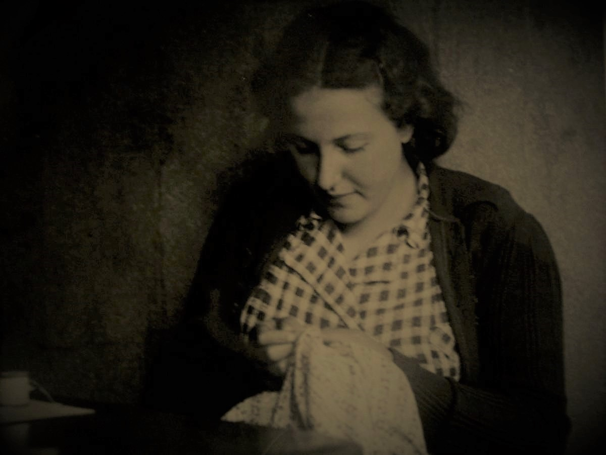
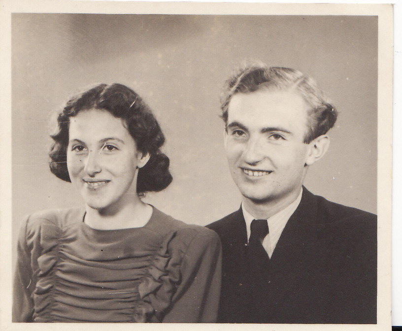
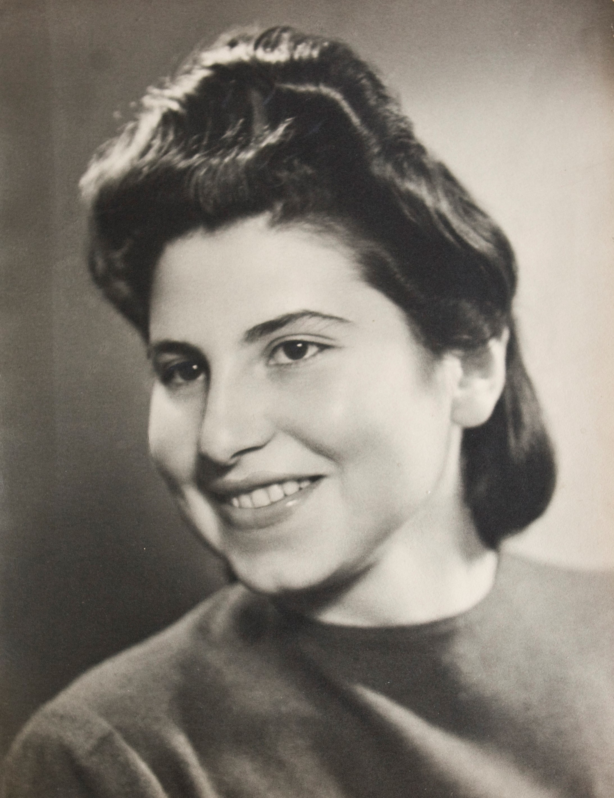
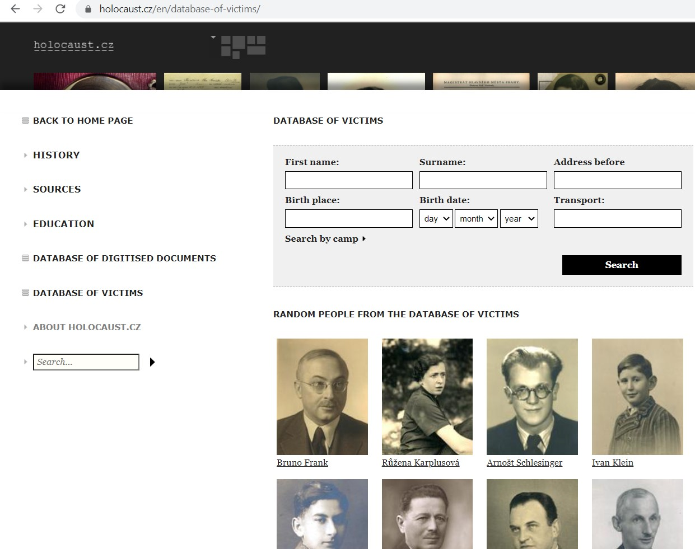
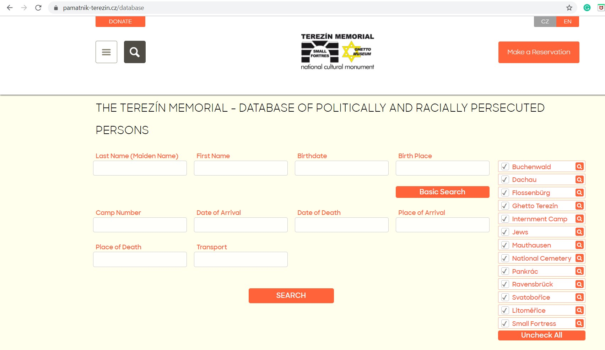
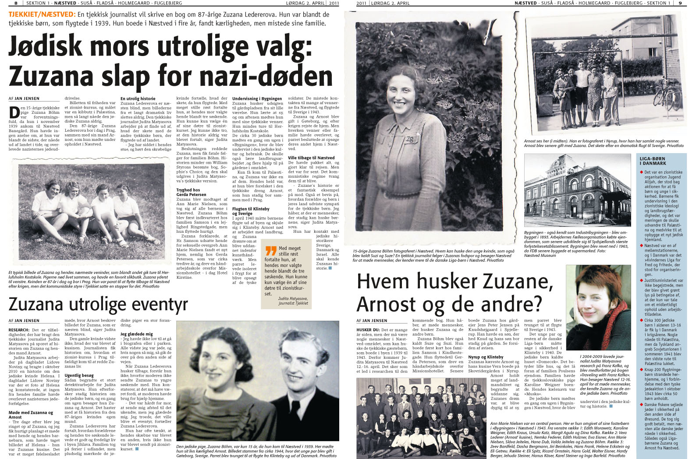

```{r setup, include=FALSE}
knitr::opts_chunk$set(echo = TRUE)
```

## Introduction


### What is this exercise about?
This is an exercise focused on coping with a situation wherein a researcher records testimonies of Holocaust survivors without official agreement, and what might happen when a survivor dies, and his / her family wants all records.

### What´s expected of you?
- Read the story of Zuzana.
- Watch the lecture about Czech Jewish teenagers in Denmark.
- Check the Theresienstadt database of victims and the Holocaust.cz database.
- Think about and discuss a solution - what can the researcher do when a family sues him / her?


## Her story
Zuzana Ledererová (née Böhmová) was born in 1924 and lived with her family in Jihlava, two hours from Prague, Czechoslovakia. In March 1939 - a few days after the Nazi occupation - her father died after a brutal interrogation by the Nazis. In April the same year, the fourteen-year-old Zuzana moved to Prague and lived in her aunt´s flat, and attended Zionist Youth Clubs for teenagers. All of them expected to go to Palestine and live there as Zionists in a kibbutz. But then the organizers from the Zionist Youth Clubs changed the plan for security reasons.  

In October 1939, Zuzana went to Denmark together with 80 other Czech Jewish teens. The local organization **Women´s League for Peace and Freedom** (Kvindernes Internationale Liga for Fred og Frihed) offered help and found Danish foster families for these Czech Jewish teenagers. After four years in Denmark, Zuzana and her future husband (also Czech) Arnost Lederer escaped in 1943 to Sweden. When the war was over, they returned to Czechoslovakia.  

In 2010, Czech researcher Judita Matyasova started to research forgotten Jewish stories. She wrote about Zuzana´s cousin, Helena Böhmová, who was killed in a concentration camp in Lublin, Poland. Soon after Judita met Zuzana for the first time and started a long-term co-operation, Judita decided to document Zuzana´s life story. They have been meeting regularly for two years.  

Zuzana told Judita that she did not want to transfer trauma from the past to her children and grandchildren, and so she asked Judita to keep her personal secrets, especially those about her parents and siblings. Judita accepted this request and kept the aforementioned secrets. She published in articles or books only what Zuzana authorized. Judita told Zuzana many times that it would be good to have an agreement about this, but Zuzana never signed such an agreement, saying that she trusted her co-operator. When Zuzana died, her relatives contacted Judita and asked her to give them all records. Judita refused and explained that she had made that promise. The family threatened to sue Judita if she will not give them the records.
<br/>

  

  

  

<font color="blue">
**Task No. 1**  

+ Watch the lecture of Judita Matyasova about her research of Czech Jewish teens in Denmark. You will find the lecture [here](https://www.youtube.com/watch?v=5Ptc6-e2ngE).  
+ Write an essay about this lecture, 1,800 characters.
</font color>

## Digital archives and databases of names and fates of holocaust survivors
Every research project is like one big puzzle. You have to collect as many of those puzzle pieces as possible. There are main databases, which are essential for your start. Here you will find descriptions of digital archives and explanations of how to find a specific story and get more information.  

### Digital archive - [Holocaust.cz](http://www.holocaust.cz/en)
This [database](https://www.holocaust.cz/en/database-of-victims/) contains the names and fates of about 80,000 people who have been deported from the territory of today's Czech Republic and other European countries during WWII because the Nazis categorized them as Jews. Most of them were deported first to the ghetto Theresienstadt, and from there later on to the extermination camps. Exact addresses can be found for those living in Prague during the 1941 registration.  

<font color="blue">
**Task No. 2**  
Go to the database page:  

  + Type first name "Helena" and last name "Böhm" - You will see two results  
  + Click on the result where the date of birth is *05. 06. 1923.*  
</font color>
<br/>

  

### Digital archive - [Terezín (Theresienstadt) Memorial database](https://www.pamatnik-terezin.cz/database)
In this database, you can find a list of names of victims of politically and racially persecuted persons deported to Buchenwald, Dachau, Flossenburg, Ghetto Terezín, Internment Camp, Mauthausen, National Cemetery, Pankrác, Ravensbruck, Svatoborice, Litomerice, and Small Fortress in Theresienstadt. There are no specific details about Zuzana´s mother and siblings, but there *is* information about her father-in-law, Emil Lederer.  

<font color="blue">
**Task No. 3**  
Go to the database page  

+ Type first name "Emil" and last name "Lederer" (The birthdate is *4. 10. 1892*)  

**Task No. 4**  
Emil Lederer died in Lublin. Find more about the Lublin concentration camp and write an essay about it (500 characters).  
</font color>
<br/>

 

## Recording testimonies and ethical dilemmas
Every interview with a Holocaust survivor is different, and it is not easy to be prepared for emotional moments during such interviews. But there are specific rules for such interviews, created by the Oral History Association. Read about ethical rules during the recording of interviews [here](https://www.oralhistory.org/oha-statement-on-ethics/) and also about the [Oral History Agreement](https://www.ohs.org.uk/wordpress/wp-content/uploads/Oral-History-Participation-Agreement-BL-v2-6-2018.pdf).  

A quote from Czech researcher Judita Matyasova: 

"I can not give one universal advice, what you have to do in those difficult situations. I think it is up to every researcher to think about his / her role in a concrete story and try to find a balance between privacy of interviewee and privacy of you as a researcher. I truly believe we have to talk about these ethical dilemmas and share our experience, as it is also part of our professional work."  

<br/>
<font color="blue">
**Task No. 5 - a topic for discussion**  
What do you think about this concept? What should one do if the subject of one's interview does not want to sign an agreement?  

**Task No. 6 - a topic for discussion**
What would you do?  
Give all records to the family?  
OR  
Refuse their request and accept the possibility that they can sue you?  
OR  
Another option?  
</font color>
<br/>

 

# Related books and articles to Zuzana´s story

+ Life of Jewish community in Jihlava, described in this [book](https://www.amazon.com/Where-She-Came-Daughters-Mothers-ebook/dp/B0042X9U66) written by Helen Epstein.

+ Czech-Jewish-German community in pre-wartime, described in this [book](https://www.amazon.com/Czechs-Germans-Jews-National-Identity/dp/1782386793) by Katerina Capkova. 

+ Passage to Palestine: A [book](https://www.amazon.com/Passage-Palestine-Young-Denmark-1932-45/dp/8774924478) about Jewish community from Central Europe in Denmark during WWII

+ More details about Jewish refugees in Denmark [here](https://www.saxo.com/dk/danmark-og-de-joediske-flygtninge-1933-1940_lone-runitz_haeftet_9788772895796)

+ Zuzana escaped to Sweden in October 1943. Read [more](https://www.gucca.dk/nothing-to-speak-of-bog-p198302?pla=1&gclid=Cj0KCQiAh4j-BRCsARIsAGeV12Bd1P2aXqBKiTTmE35sEmkuQ63-ZhVZjjx3cWo0ILXCQjeweFNQkBIaAvf0EALw_wcB) about these dramatic moments, when Jewish refugees had to leave Denmark.

+ Transferring trauma in the families of a Holocaust survivor, described in this [book](https://www.amazon.com/Children-Holocaust-Conversations-Daughters-Survivors/dp/0140112847) by Helen Epstein

+ Read more about recording stories of Holocaust survivors [here](https://sfi.usc.edu/news/2015/08/9856-liliane-weissberg-2015-rutman-fellow-studies-trauma-narrative-visual-history).

+ Listen to the [podcast](http://sharethesamesky.com/podcast) created by Rachael Cerrotti, granddaughter of Hana Dubova, a friend of Zuzana. She describes the forgotten story of Jewish teens in Denmark. 


