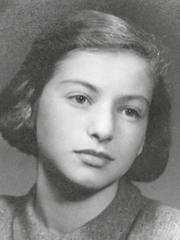
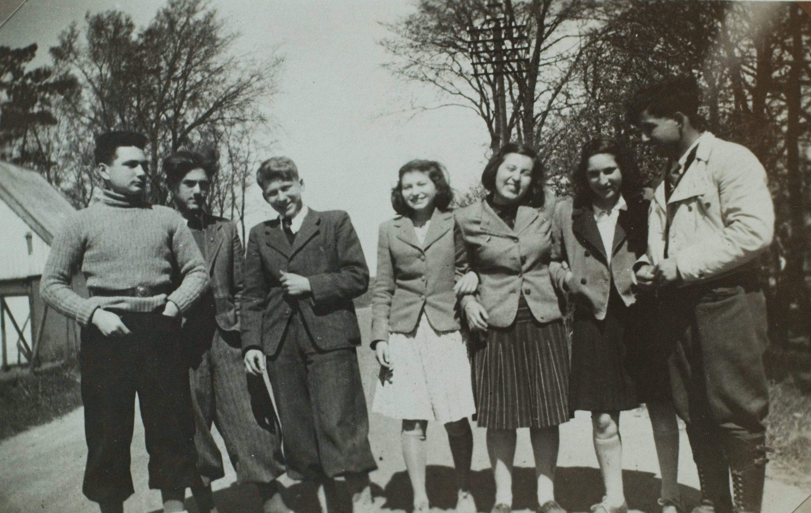
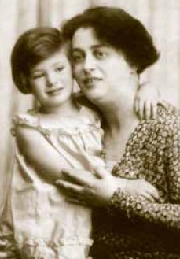
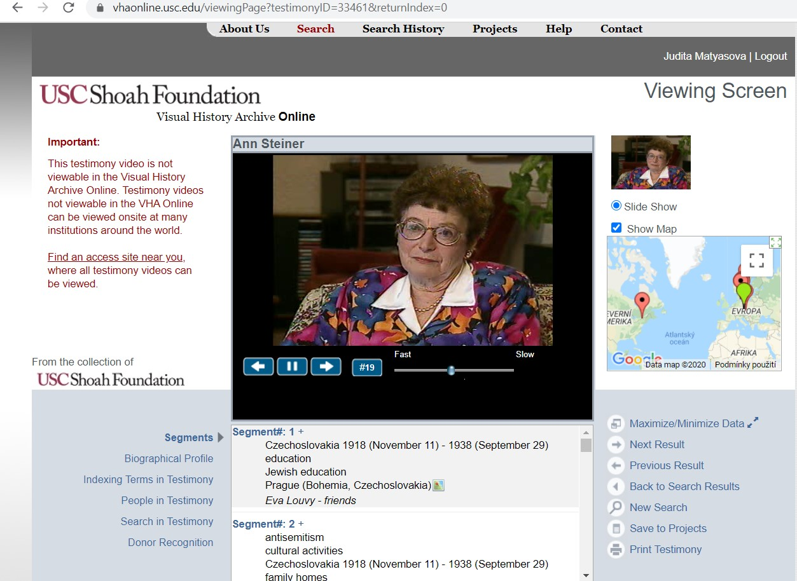
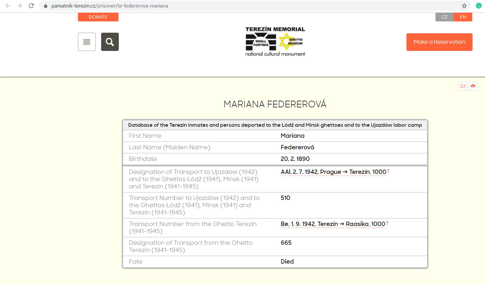
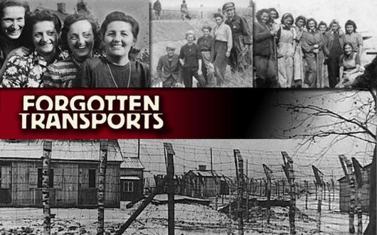
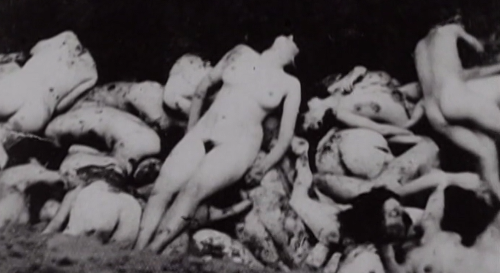
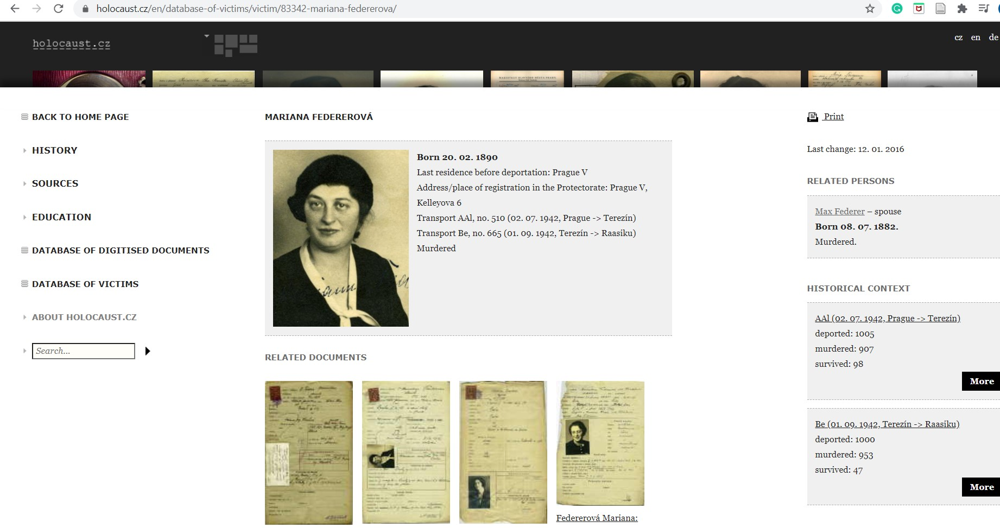
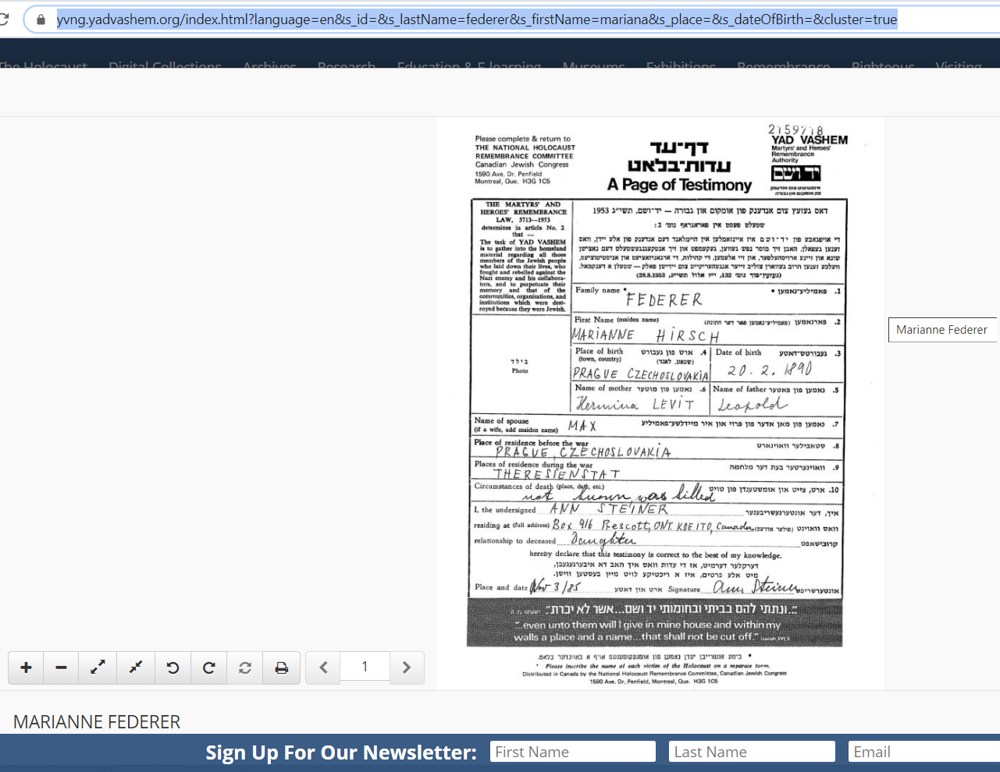
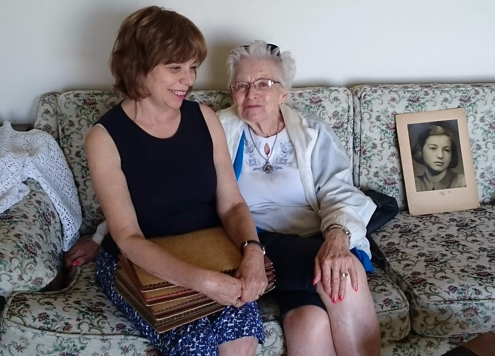

```{r setup, include=FALSE}
knitr::opts_chunk$set(echo = TRUE)
```

## Introduction


### What is this exercise about?
This is an exercise focused on coping with a situation resulting from a researcher discovering some very emotionally disturbing personal materials in archives and having to communicate them to a Holocaust survivor.  

### What's expected of you?
+ Read the story of Nemka.
+ Find more information about her family in digital archives and see the structure of the database.
+ Watch the documentary film "Forgotten Transport to Estonia" and write an essay about this transport.
+ Think about and discuss the ethical dilemma of the researcher.


## Her story
Anne Marie Steiner was born in 1924 to a wealthy Jewish family in the center of Prague, Czechoslovakia. She was a very athletic girl, but she also loved literature and cinema. Her nickname amongst her friends in the Zionist Youth Club was Nemka. In the club, they often discussed their collective future - they wanted to live in a kibbutz and enjoy community life. They all attended Zionist preparatory school in Prague and in the spring of 1939, they expected to go to Palestine on a trip organized by the youth club.   

In the summer of 1939, the organizers of the Zionist Youth Clubs changed the plan and decided to send Nemka and the other teenagers to Denmark, where the local organization **Women´s League for Peace and Freedom** (Kvindernes Internationale Liga for Fred og Frihed), offered to help. The organization found Danish foster families for these Czech Jewish teenagers. After four years in Denmark, Nemka and her future husband (also Czech) Karel Steiner escaped to Sweden in 1943. When the war was over, they spent some time in Czechoslovakia and Israel before settling in Canada.  

In 2010, Czech researcher Judita Matyasova started research of this forgotten story of Czech Jewish teens. A few weeks after the death of Nemka´s husband in December 2011, Judita found a way to contact Nemka and called her for the first time. Nemka was very happy when she heard about Judita´s research, which would allow her to share her stories from pre-wartime and wartime. One day, Nemka made a request of Judita: “May I ask you for a favour? I never found out what happened to my mother. I only know she was in ghetto Theresienstadt and then she was killed somewhere in Estonia. I know you are a very good researcher, so maybe you can find out more details for me? Please tell me the truth about my mother!“  

Judita immediately knew where to search because she was familiar with the famous documentary film “Forgotten Transport to Estonia,” filmed by Czech historian, Lukas Pribyl. She rewatched the film and also read the book about this topic. Judita found out that Marianne (Nemka’s mother) was two months in ghetto Theresienstadt and then she was imprisoned and deported to Estonia with a group of 1.000 Jewish people. In the town of Raasiku, there was a selection. 100 young women were sent to a labour camp. All others, including Nemka´s mother, went by bus to the beach Kalevi Liiva. There, they were ordered to strip naked and dig their own graves. Then they were shot by Nazi guards.  

When Judita told Nemka about the film and the book, Nemka asked this: “So, what did you find out about my mother? Some photos? Or other details?”. In the book, Judita had found photos of a pile of corpses, and it could be possible that Nemka might recognize her mother within it.  

<br//>
<font color="blue">
**Task No. 1**

+ Watch this lecture of Judita Matyasova, where she talks about the story of Czech Jewish teenagers in Denmark. You will find her lecture [here](https://www.youtube.com/watch?v=5Ptc6-e2ngE).
+ Write a resume of this lecture 1.800 characters.
</font color>
<br//>








## Digital archives and databases of names and fates of holocaust survivors
Every research project is like a big puzzle. You have to collect as many of those puzzle pieces as possible. There are main databases, which are essential for your start. Here you will find descriptions of digital archives and explanations of how to find a specific story and get more information.  

### Digital archive - USC Shoah Foundation
The [Visual History Archive](https://sfi.usc.edu/) of the [USC Shoah Foundation](https://vhaonline.usc.edu/login) allows users to search through and view more than 54,000 video testimonies of survivors and witnesses of genocide. Initially a repository of Holocaust testimony, the Visual History Archive has expanded to include testimonies from the Armenian Genocide that coincided with World War I, the 1937 Nanjing Massacre in China, the Cambodian Genocide of 1975-1979, the Guatemalan Genocide of 1978-1983, the 1994 Genocide against the Tutsi in Rwanda, the ongoing conflicts in the Central African Republic and South Sudan, and anti-Rohingya mass violence. It also includes testimonies about contemporary acts of violence against Jews.  

<br//>
<font color="blue">
**Task No. 2 - Research Namka's story**
Go to the website of Visual History Archive Online [here](https://vhaonline.usc.edu/login):

+ Create an account  
+ Login into your account  
+ Go to main menu: Click on Search, then click on People Search  
+ Type “Ann M.” into First Name column  
+ Type “Steiner” into Last Name  
+ Click the Female and Search buttons  
+ Mark her name and click button on the right side of the page Next  
+ Ann´s photo will show up and you will see her profile  
+ You will see key words.   
</font color>
<br//>



<br//>
<font color="blue">
**Task No. 3**  
Write a summary of Nemka´s story (500 characters)
</font color>
<br//>

### Digital archive - [Terezín (Theresienstadt) Memorial database](https://www.pamatnik-terezin.cz/database)
The Terezín Memorial is a database of politically and racially persecuted persons deported to Buchenwald, Dachau, Flossenbürg, Ghetto Terezin, Internment Camp, Mauthausen, National Cemetery, Pankrác, Ravensbrück, Svatobořice, Litoměřice, and Small Fortress.  

<br//>
<font color="blue">
**Task No. 4**  
Go to database: 

+ Type in the first name “Mariana” and the last name “Federerova”  
+ Click on Search  
+ Then, the result will appear  
+ Click on the symbol of hand glass  
+ Then you will see detailed information about Mariana  
</font color>
<br//>



<br//>
<font color="blue">
**Task No. 5**  
Watch the documentary film about the transport from ghetto Theresienstadt to Estonia [here](http://portfolio.forgottentransports.com/).   
Then, write a short text about this group of prisoners (1.500 characters).  
</font color>
<br//>





### Digital archive – Holocaust.cz
This [database](https://www.holocaust.cz/en/database-of-victims/) contains the names and fates of about 80,000 people who have been deported from the territory of today’s Czech Republic and other European countries during WWII because the Nazis categorized them as Jews. Most of them were deported first to the ghetto Theresienstadt, and from there later on to the extermination camps. Exact addresses can be found for those living in Prague during the 1941 registration.

<br//>
<font color="blue">
**Task No. 6**  
Go to the database homepage:  

+ Type in the first name “Mariana” and the last name “Federer”  
+ Click on Search  
+ You will see Mariana´s photo - click on More  
</font color>
<br//>



<br//>
<font color="blue">
**Task No. 7**  
Find more information about Raasiku and write a resume of 500 characters.  
</font color>
<br//>

### Digital archive – Yad Vashem - The World Holocaust Remembrance Center, Jerusalem
One of the main tasks of [Yad Vashem](https://yvng.yadvashem.org/) is to collect, examine and publish testimonies of the Holocaust and the disaster and the heroism it called forth. Yad Vashem, together with its partners, has collected and recorded the names and biographical details of millions of victims of systematic anti-Jewish persecution during the Holocaust (Shoah) period.  

<br//>
<font color="blue">
**Task No. 8**  
Go to the Name [database](https://yvng.yadvashem.org/):   

+ Type “Marianne” in First name and “Federer” in Last name   
+ Click on Federer  
+ Read the scan of this [document](https://yvng.yadvashem.org/index.html?language=en&s_id=&s_lastName=federer&s_firstName=mariana&s_place=&s_dateOfBirth=&cluster=true), filled in by Marianne´s daughter Ann  
</font color>
<br//>



<br//>
<font color="blue">
**Task No. 9**   
What did Ann write about her mother´s death in the column “Circumstances of Death”?   
Response: not known, was killed.  
</font color>
<br//>


## Recording testimonies and ethical dilemmas
Researchers might face various ethical dilemmas during their work. Every case is specific, and it is impossible to give universal advice, but there are specific rules for oral history work recommended by the international organization the **Oral History Association**. Read more about the ethical rules of the Oral History Association [here](https://www.oralhistory.org/oha-statement-on-ethics/).  

A quote from Czech researcher Judita Matyasova:  
“I don’t think you can be prepared for such a difficult moments as it is described in this educational material, but it is up to every researcher, where he/she sees responsibility for the story and responsibility to the interviewee. It is not easy to decide what to do in this situation, but I truly believe we have talk about these ethical dilemmas and share our experience, as it is also part of our professional work.”  

<br//>
<font color="blue">
**Task No. 10**   
Think about and discuss what would you do if you were Judita?   
Would you tell Nemka the whole truth?   
OR  
Tell Nemka something like a half-truth?  
OR  
Another option?  
</font color>
<br//>



# Related books and articles to Nemka's story

+ Passage to Palestine: A [book](https://www.amazon.com/Passage-Palestine-Young-Denmark-1932-45/dp/8774924478) about Jewish community from Central Europe in Denmark during WWII  

+ More details about Jewish refugees in Denmark [here](https://www.saxo.com/dk/danmark-og-de-joediske-flygtninge-1933-1940_lone-runitz_haeftet_9788772895796)  

+ Nemka escaped to Sweden in October 1943. Read [more](https://www.gucca.dk/nothing-to-speak-of-bog-p198302?pla=1&gclid=Cj0KCQiAh4j-BRCsARIsAGeV12Bd1P2aXqBKiTTmE35sEmkuQ63-ZhVZjjx3cWo0ILXCQjeweFNQkBIaAvf0EALw_wcB) about these dramatic moments where Jewish refugees had to leave Denmark  

+ Read more about [trauma](https://sfi.usc.edu/news/2015/08/9856-liliane-weissberg-2015-rutman-fellow-studies-trauma-narrative-visual-history) in Holocaust survivors families  

+ Listen to the [podcast](http://sharethesamesky.com/podcast) created by Rachael Cerrotti, granddaughter of Hana Dubova who is a friend of Nemka’s. She describes the forgotten story of Jewish teens in Denmark
