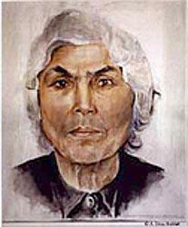

```{r setup, include=FALSE}
knitr::opts_chunk$set(echo = TRUE)
```

## Introduction


### What is this exercise about?
The main story is based on Dina Babbitt’s experience. She survived the concentration camp because she painted watercolours for the famous doctor Josef Mengele in Auschwitz. IN exchange for this, he promised her that she and her mother would remain alive. But who is the owner of these watercolours? And how is it that a personal artistic item became an important object in a museum?  

### What's expected of you?
+ Read Dina's story.  
+ Watch her testimony on the digital archives at United States Holocaust Memorial Museum.  
+ Watch the discussion of Dina and historian David Rappaport.  
+ Search for information about Dina on the online archive of American Congress.  
+ Think about the ethical dilemma of Dina’s situation.  


## Her story
Dina Babbitt (née Gottlieb) was born in 1923 in Brno, Czechoslovakia. At the beginning of WWII, she was a talented art school student, and she dreamt about owning her own art studio. When the war started, Dina had to leave school like all other Jewish students. In 1942, she was deported together with her mother to the Theresienstadt ghetto, and then to Auschwitz. She was an active member of the young artist community in Theresienstadt, as well as later on in Auschwitz. Josef Mengele was a famous doctor in Auschwitz. He conducted inhumane medical experiments on prisoners at the camp. In 1943, he heard about the talented Dina and ordered her to paint portraits of Roma prisoners in the camp in order to document their existence. In return, he promised her that she and her mother would survive. During her time in Auschwitz, she painted seven portraits of Roma prisoners, all of whom were later sent to the gas chambers.  

Dina and her mother survived the war. Dina moved to the USA, where she became famous as an illustrator. In 1973, Dina got a letter from researchers at the Memorial and Museum Auschwitz – Birkenau. They wrote to her that researchers finally identified her as the artist of the Roma watercolours. Researchers didn't know her name for a long time, as there was only the signature „Dina“ on the watercolours and no other details about the artist. Dina traveled to the museum, expecting to be given her artwork. However, the researchers refused, stating that these watercolours were very valuable items that must remain at the museum. Dina sued the museum, and a long-lasting international trial began.  

Dina had great support from her fellow artists, not only from America but also from different parts of the world. 450 famous cartoonists signed a petition in her support. The American Congress negotiated with Polish authorities, but without success.<br>
Researchers at the museum always claimed that returning the paintings to Dina would set a dangerous precedent, one that might cause other artists who were imprisoned during WWII to demand their artworks back. Dina died in 2009; she hoped until the last days of her life that she would win the trial.  



 

## Digital archives and databases of names and fates of holocaust survivors
Every research project is like one big puzzle. You have to collect as many of  those puzzle pieces as possible. There are main databases, which are essential for your start. Here you will find descriptions of digital archives and explanations of how to find a specific story and get more information.  

### Digital archive – [US Holocaust Memorial Museum in Washington, D.C.](https://www.ushmm.org/)
The US Holocaust Memorial Museum’s [Database](https://www.ushmm.org/remember/resources-holocaust-survivors-victims/database-of-holocaust-survivor-and-victim-names) of Holocaust Survivor and Victim Names contains records of people persecuted during World War II under the Nazi regime, including Jews, Roma, Sinti, Poles (and other Slavic peoples), Soviet prisoners of war, persons with disabilities, political prisoners, trade union leaders, "subversive" artists, Catholic and Lutheran clergy who were seen as opponents of the regime, resisters, Jehovah's Witnesses, male homosexuals, and criminal offenders, among others. Learn more about the victims of the Holocaust and Nazi persecution.  

<br//>
<font color="blue">
**Task No. 1**  
Go to the database page:  

+ Type “Dina Gottlieb” or “Dina Babbitt” into the Search box.  

Watch an interview with Dina [here](https://collections.ushmm.org/search/catalog/irn37287). The interview is moderated by David Rappaport, teacher of history at Palo Alto High School.  
</font color>
<br//>


<br//>
<font color="blue">
**Task No. 2**  
Write a resume of her life story in 1,800 characters.  
</font color>
<br//>


## Ethical dilemma and international trial
The story of Dina and her watercolour paintings started an international debate, as did the trial: Who is the owner of these artworks? What should be done in a situation like this? Should the Auschwitz museum respect Dina's rights as an artist, or is it more important to present her works to the public as historical artifacts? Or would it perhaps be more right to donate these artworks to the Roma community?  

A quote from Czech researcher Judita Matyasova: 
“Dina´s story is a really good impulse for public and academic discussion. I think it is also important part of work of researchers: they have to think about different perspectives. What one decision might cause to individuals or groups of people? Is it more important the public interest? Or interest of my person?”  

There are different perspectives on this debate:  

+ Read about the ethical dilemma in this [article](https://jhvonline.com/auschwitz-artifacts-an-ethical-dilemma-for-museums-p743-98.htm), written by Dinah Spritzer. 
+ Read more about activities of the American Congress [here](https://www.congress.gov/bill/106th-congress/house-concurrent-resolution/162/text).
+ Read also another perspective, described in this [book](https://www.amazon.com/Watercolours-Story-Auschwitz-Lidia-Ostalowska-ebook/dp/B0756K3WQQ) by the famous Polish reporter, Lidia Ostalowska.  


<br//>
<font color="blue">
**Task No. 3: topic for discussion**
Who is the owner of Dina´s artworks?  
Dina as the artist?  
OR  
The Auschwitz Museum?  
OR  
The Roma community?  
OR  
Doctor Josef Mengele´s relatives? (as he ordered these artworks)  
</font color>
<br//>
